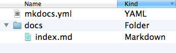

### Installation de mkdocs


## Installer MkDocs via le terminal :
```bash
pip install mkdocs-material
```
## Si vous souhaitez créer un fichier afin de stocker toutes vos documentations, il faudra exécuter cette commande


```bash
# on crée un dossier qui s'appelle my-project que vous pouvez changer à votre gise
mkdocs new .
```
### Consultez vos documents grâce à Mkdocs Serve.


En effet, après que vous soyez positionné dans votre dossier, vous pouvez lancer la commande suivante.


```bash
mkdocs serve
```


# Warning


Si jamais vous êtes sur un projet Symfony, en fonction de l'IDE, veuillez vérifier si celui-ci s'occupe de la redirection de port automatiquement.


Par défaut, mkdocs serve lance sur http://127.0.0.1:8000


### Tips
Si vous rencontrez un problème et que vous êtes dans le cas précédent, je vous invite à consulter vos ports actifs et à en mettre un autre avec la commande qui suit :


```bash
mkdocs serve – à votre adresse IP : votre port
# exemple
# mkdocs serve -a 127.0.0.1:8080
```


Après l'exécution de cette commande, vous trouverez une architecture ressemblant à ça.





## Customizer le nom de vos pages


```yaml
site_name: nom de votre site
nav :
  - Home : nom de votre page qui renverra vers le home (extension attendu md)
  - Api Platform : //


# exemple
# site_name: My Docs
# nav :
#   - Home : index.md
#   - Api Platform : Api-platform.md
```


### Récapitulatif


Grâce à cette documentation, vous avez toutes les informations nécessaires pour écrire de merveilleuses documentations comme celle-ci, consultable sur serveur Web ou non, avec des possibilités de personnalisation.


À vous de jouer :)